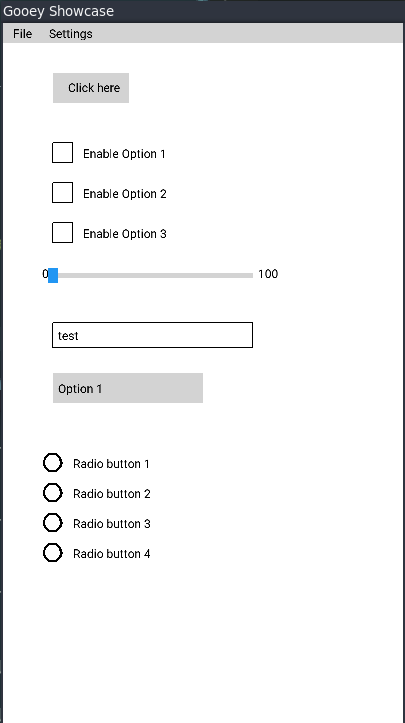

<p align="center">
  
</p>

# Gooey GUI Library

Gooey is a lightweight and feature-rich GUI (Graphical User Interface) library originally designed for X11 environments but now cross-platform. It provides a range of customizable widgets and layouts for creating responsive and modern desktop applications. The library is optimized for simplicity and offers a flexible API for developers.

<p align="center">
  
</p>

## Features

- **Wide Range of Widgets**:
  - Labels
  - Buttons
  - Checkboxes
  - Radio Buttons (and Groups)
  - Sliders
  - Dropdown Menus
  - Textboxes
  - Canvas

- **Layouts**:
  - Horizontal
  - Vertical
  - Grid-based layouts

- **Customization Options**:
  - Support for widget-specific callbacks
  - Styling with predefined color schemes
  - Interactive hover and click states

- **Event Handling**:
  - Mouse clicks, motion, and keypress events
  - Dynamic updates through an efficient redraw system
  - Simple signaling system

## Getting Started
1. Clone repo 
```bash 
git clone https://github.com/YASSINE-AA/GooeyGUI.git
```
2. Update submodules: 
```bash 
git submodule update --init --force --remote
```
3. Apply patches: 
```bash
./scripts/apply-cjson-submodule-patch.sh 
```
4. Init Cmake 
```bash
cmake -S . -B build
cd build 
make all
```
5. To install target in you local machine 
```bash 
sudo make install
```
6. Run example 
```bash
cp examples/roboto.ttf build/
./example_basic
```

### Prerequisites

Ensure your development environment includes:
- **X11 Development Libraries**: Gooey relies on X11 (`<X11/X.h>`, `<X11/Xlib.h>`, `<X11/Xutil.h>`).
- **GLFW Development Library**: Gooey relies on GLFW (`<GLFW/glfw3.h>`).
- **OpenGL Development Library**: Gooey relies on GLAD (`<GLAD/glad.h>`).
- **cJSON Development Library**: Gooey relies on cJSON (`<cjson/cJSON.h>`).

### Installation

To integrate Gooey into your project:
1. Include `gooey.h` in your project directory.
2. Add `#include "gooey.h"` to your source files.
3. Link libraries.

### Example Usage
- create a example.c file then copy the following code. 

```c
    #include <Gooey/gooey.h>
    #include <stdio.h>
    #include <unistd.h>
    #include <stdlib.h>
    
    bool state = 0;
    GooeyWindow msgBox;
    
    void messageBoxCallback(int option)
    {
        LOG_INFO("MessageBox option: %d", option);
    }
    
    void onButtonClick()
    {
        state = !state;
        GooeyWindow_MakeVisible(&msgBox, state);
    }
    
    int main()
    {
        set_logging_enabled(true);
        set_minimum_log_level(DEBUG_LEVEL_INFO);
    
        Gooey_Init(GLFW);
    
        GooeyWindow win = GooeyWindow_Create("Hello World", 400, 300, 1);
    
        msgBox = GooeyMessageBox_Create("Hello", "Welcome to Gooey!", MSGBOX_INFO, messageBoxCallback);
    
        GooeyMessageBox_Show(&msgBox);
    
        GooeyButton_Add(&win, "Click Me", 150, 100, 100, 40, onButtonClick);
    
        GooeyWindow_Run(2, &win, &msgBox);
    
        GooeyWindow_Cleanup(2, &win, &msgBox);
    
        return 0;
    }
 
    
```
- to compile and run follow these steps  
```bash 
gcc example.c -o example -I/usr/local/include/Gooey -L/usr/local/lib/ -lGooeyGUI -Wno-deprecated-declarations
```
> Note ignore the compilation warning, will be fiwed in the upcoming days 
```bash 
LD_PRELOAD=/usr/lib/x86_64-linux-gnu/libasan.so.6 ./example
``` 
## Documentation

- You can find the full API documentation <a href="https://yassine-aa.github.io/GooeyWebsite/docs/index.html">here</a>. 

## Contributing

Contributions are welcome! If you have suggestions or encounter issues, feel free to open an issue or submit a pull request.

## License

Gooey is released under the GPL3 License.

---

Start building interactive and modern desktop applications with Gooey today!
